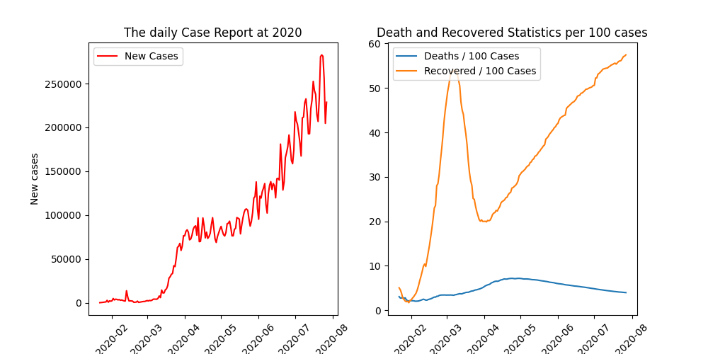
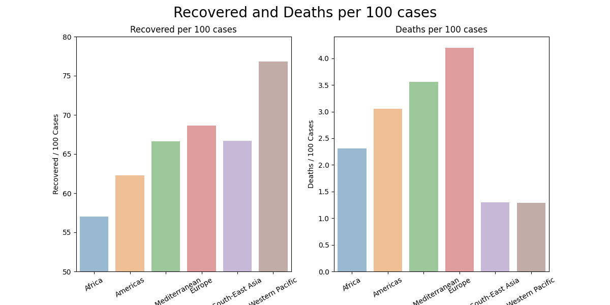
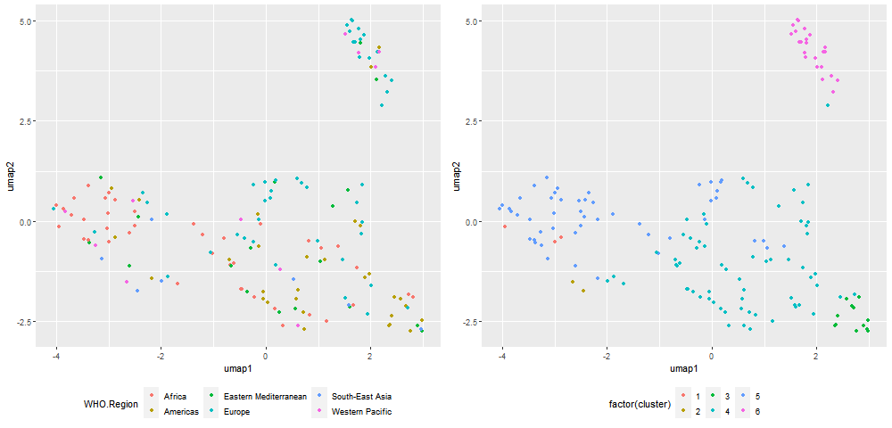
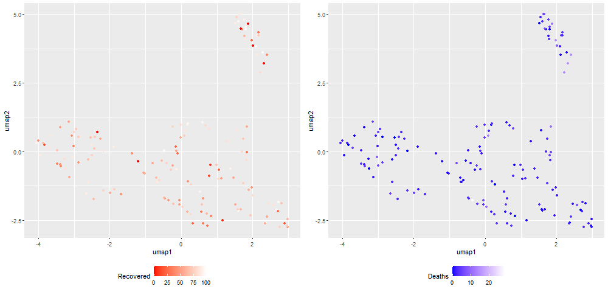

## Introduction 

The coronavirus COVID-19, which originated in Wuhan, China in 2019, has had an unprecedented impact across the globe.
Although its fatality rate is low, its extraordinarily high transmission rate has plunged the entire world into a new type of crisis.
Every nation has been tested in their ability to respond to this crisis.
The key elements of responding to an infectious disease include 1.
the ability to produce accurate statistics, 2.
medical capabilities in diagnosis, prevention, and treatment, and 3.
the effectiveness of measures to minimize the risk of infection and suppress transmission.
All these elements are influenced by a nation\'s characteristics, economic strength, medical science capabilities, and administrative efficiency.
Therefore, this report aims to examine the situation of the COVID-19 crisis in various countries in 2020 and explore the relationship between COVID-19 and economic power.

COVID-19, while having a low mortality rate, has an unprecedentedly high rate of infection, making it an extremely dangerous disease.
Brief contacts such as being in the same room, sitting at the same table in a restaurant, or having a short conversation have been enough for transmission, leading to its rapid spread.
It is now difficult to find anyone who has not been affected by COVID-19.
Although its mortality rate is lower compared to past pandemics, its impact and severity are by no means less significant, often leading to frequent medical paralysis nationwide.

## Trend of Covid 19 in 2020

The chart titled 'The Daily Case Report at 2020' shows the daily increase in COVID-19 cases up until August 2020.
Significant changes can be observed in mid-March, early April, and mid-May of 2020.
Until March 2020, the number of cases was somewhat manageable, but from mid-March, the daily infection rate increased sharply, reaching 75,000 cases.
After that, there was not a significant increase in daily cases until early April, but then control was lost again, and the numbers sharply increased, reaching 250,000 cases by the end of August.

By examining the 'Death and Recovered Statistics per 100 cases', we can get a more tangible sense of the situation at that time.
Until mid-March 2020, the number of recoveries steadily increased, indicating the situation was under control.
However, with the explosion of cases in March, the number of recoveries sharply decreased.
This can be interpreted as the result of exceeding the nation's control capacity, with the number of available hospital beds dramatically reduced as the number of cases far exceeded expectations.
After a significant decrease, from early April, a strategic national response and management led to a gradual increase in the number of recoveries, indicating that control over the coronavirus was being regained

```{r }
 
```

The following are regional statistics on recoveries and deaths based on WHO data.
'Western Pacific', which includes countries like South Korea, Japan, and Australia, shows the most favorable results in terms of the number of recoveries and deaths.
Europe follows with a high number of recoveries, but it's also important to note that they have the highest number of deaths.
Conversely, Africa has the lowest numbers both in recoveries and deaths.
However, it is important to consider that there are differences in how each country collects data on infections, recoveries, and deaths.
Therefore, these figures could potentially be overestimated or underestimated.

```{r}
 
```

## Data Analysis with Economic data

Now, we have proceeded to analyze the COVID data along with economic data of each country.
First, we used economic data of each country for UMAP dimensionality reduction.
The economic data used includes GDP growth rate, GDP per capita, import rate, export rate, and total population.
The results of the UMAP dimensionality reduction are as follows.
The left image is labeled with WHO regions based on the UMAP results.
Overall, while the differentiation between regions appears weak, Europe and Africa can be somewhat distinctly observed as clustered together.
Given the economic differences between these two regions, the UMAP results can be considered rational.
The right image shows the results after clustering based on this data, with labels attached.
The European islands in the top right, African regions on the left, and the rest show that the cluster analysis has been appropriately and successfully conducted.

```{r}
 
```

The following image visualizes the results of combining data on the number of recoveries and deaths per 100 cases of COVID with the UMAP analysis based on each country's economic data.
The basic hypothesis is that countries with stronger economies would have better management and health administration, thus less impact from COVID.
However, the image does not clearly show a correlation between a country's economic capability and the impact of COVID.

This can be interpreted in two ways: 1.
Even countries with high economic power were not immune to the impact of COVID, suggesting that COVID had a strong influence on all countries; 2.
In countries with lower economic power, the data collection on COVID might not have been as efficient, leading to an underestimation of its impact.
To determine which interpretation is more accurate, an analysis is needed to verify if the collected data accurately reflects reality in all countries, but this is currently challenging to achieve.

```{r}
 
```

Additionally, the influence of economic power (import, export, GDP per capita, inflation) on new cases, deaths, and recoveries was analyzed using regression analysis.
The table below is a collection of p-values for each of these factors.
When testing at a 5% significance level, only exports and GDP per capita can be interpreted as having an impact on deaths per 100 cases.
However, since they do not influence new cases and recoveries, the aforementioned conclusion can be considered to remain valid.

```{r}
data = read.csv("./table/result_lm.csv")
print(data)
```

## Conclusion and future research

Through the analyses conducted above, we explored the progression of COVID-19 in 2020 and the relationship between each country's economic power and COVID-19 recoveries and deaths.
Utilizing dimension reduction, cluster analysis, and regression analysis, the data, if deemed reliable, suggest that COVID-19 was a disaster that struck globally, irrespective of economic power.
However, there are several limitations in the data that make it difficult to fully trust these results.
To address this, more time needs to be devoted to collecting sufficiently reliable data and analyzing relevant studies, including more influential economic variables in the analysis.

Additionally, while the impact of economic power on COVID-19 was significant, the impact of COVID-19 on the economy was also substantial, suggesting that the influence is mutual.
Therefore, to analyze these factors, employing causal inference analysis or network analysis along with the current methods could enable a more in-depth analysis of COVID-19 and economic power.

### Appendix. Data Description

1.  Country_wise_latest.csv
    -   Countrywise Covid 19 data include new case, deaths and recoveread
2.  day_wise.csv
    -   Daywise Covid 19 data include new case, deaths and recovered
3.  WEO_Data.csv
    -   world economic data containing GDP, import and export, population
